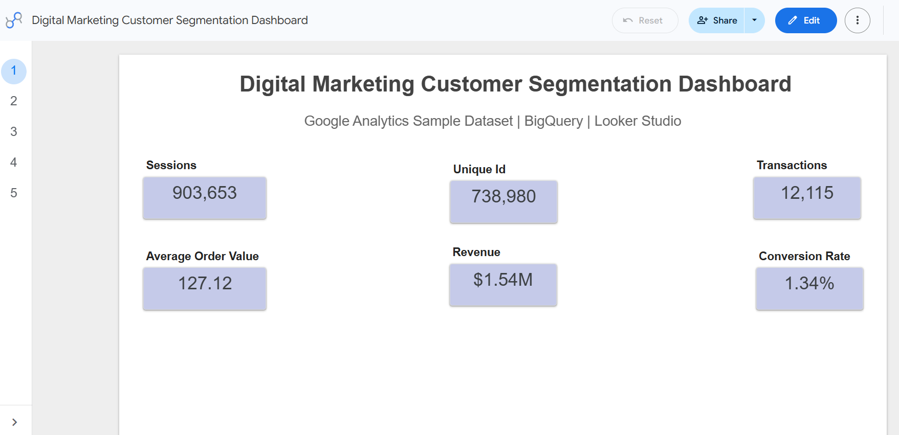
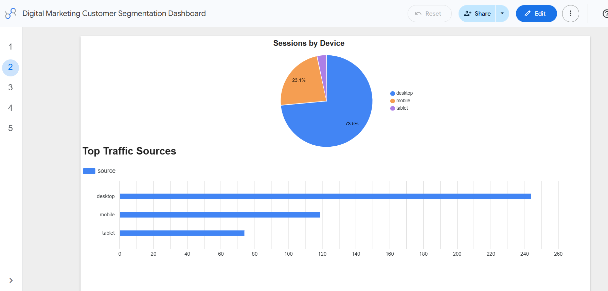
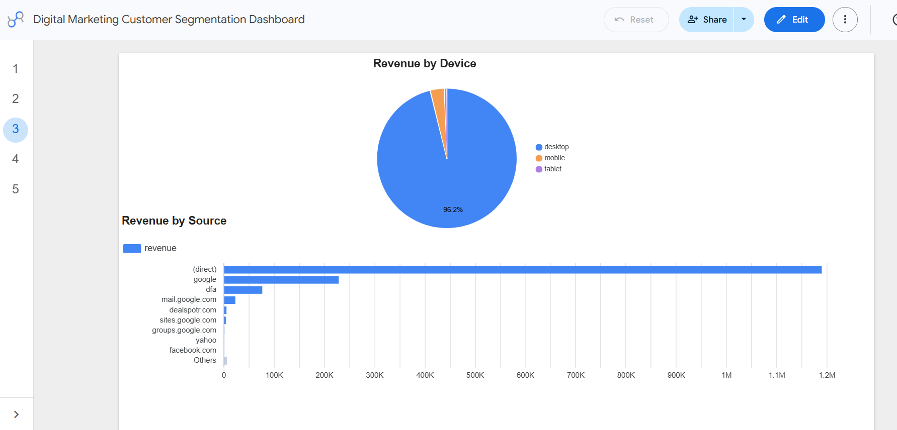
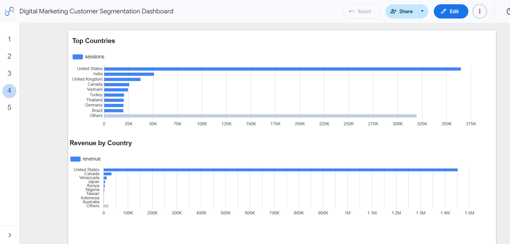
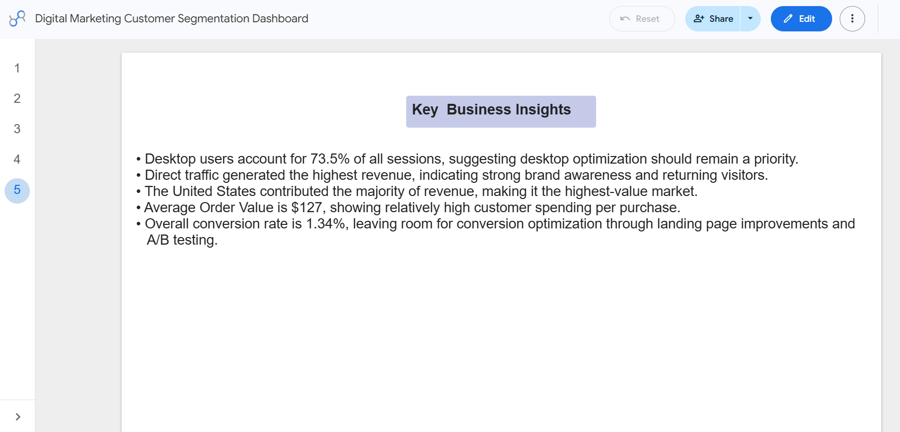

#  Digital Marketing Customer Segmentation Dashboard

An end-to-end digital marketing analytics project built using **Google BigQuery, SQL, and Looker Studio** to analyze website traffic, customer behavior, revenue performance, and geographic trends using the Google Analytics Sample Dataset.

---

##  Project Overview

This project analyzes customer interactions from the Google Analytics Sample Dataset to uncover insights that can help businesses improve marketing performance and customer acquisition.

Using SQL queries in BigQuery, key marketing metrics were calculated and visualized through an interactive multi-page Looker Studio dashboard.

The dashboard provides executives and marketing teams with a quick overview of website performance, customer behavior, revenue trends, and geographic performance.

---

##  Project Objectives

- Analyze website traffic and customer sessions
- Measure overall business performance using key KPIs
- Compare website usage across different devices
- Identify high-performing traffic sources
- Analyze revenue by marketing channel
- Evaluate customer distribution by country
- Calculate conversion rate and average order value
- Present business insights through an interactive dashboard

---

#  Tech Stack

| Tool | Purpose |
|------|----------|
| Google BigQuery | Data Warehouse |
| SQL | Data Analysis |
| Google Analytics Sample Dataset | Dataset |
| Looker Studio | Dashboard & Visualization |
| Git | Version Control |
| GitHub | Project Repository |

---

#  Dataset

**Dataset**

Google Analytics Sample Dataset

```
bigquery-public-data.google_analytics_sample.ga_sessions_*
```

The dataset contains hundreds of thousands of Google Merchandise Store website sessions including:

- Visitors
- Sessions
- Transactions
- Revenue
- Device Category
- Traffic Source
- Country

---

#  Dashboard Overview

## Page 1 — Executive Overview

KPIs included:

- Total Sessions
- Unique Users
- Total Transactions
- Revenue
- Average Order Value
- Conversion Rate

This page provides a high-level summary of website performance.

---

## Page 2 — Device Analysis

Visualizations:

- Sessions by Device (Pie Chart)
- Top Traffic Sources (Bar Chart)

Purpose:

Understand which devices generate the highest customer traffic.

---

## Page 3 — Revenue Analysis

Visualizations:

- Revenue by Device
- Revenue by Traffic Source

Purpose:

Identify which customer segments and marketing channels generate the highest revenue.

---

## Page 4 — Country Analysis

Visualizations:

- Sessions by Country
- Revenue by Country

Purpose:

Compare customer activity and revenue contribution across different countries.

---

## Page 5 — Key Insights

Business summary highlighting:

- Desktop generated the majority of sessions.
- Direct traffic produced the highest revenue.
- United States generated the highest revenue.
- Average Order Value ≈ $127.
- Conversion Rate ≈ 1.34%.

---

#  Key Metrics

| Metric | Value |
|---------|-------|
| Sessions | 903,653 |
| Unique Users | 738,980 |
| Transactions | 12,115 |
| Revenue | $1.54M |
| Average Order Value | $127.12 |
| Conversion Rate | 1.34% |

---

#  SQL Analysis

The project includes SQL scripts for:

- Traffic Source Analysis
- Device Analysis
- Country Analysis
- Revenue by Source
- Conversion Rate Calculation
- Revenue by Device
- Revenue by Country
- Average Order Value
- Purchaser Analysis
- Customer Segmentation
- Customer Summary

---

#  Repository Structure

```
Digital-Marketing-Customer-Segmentation/

│
├── Dashboard/
│   └── Looker Dashboard.pdf
│
├── Images/
│   ├── overview.png
│   ├── device.png
│   ├── revenue.png
│   ├── country.png
│   └── insights.png
│
├── Report/
│
├── Sql/
│   ├── 01_traffic_sources.sql
│   ├── 02_device_analysis.sql
│   ├── 03_country_analysis.sql
│   ├── 04_revenue_by_source.sql
│   ├── 05_conversion_rate.sql
│   ├── 06_revenue_by_device.sql
│   ├── 07_revenue_by_country.sql
│   ├── 08_average_order_value.sql
│   ├── 09_customer_segmentation.sql
│   ├── 10_customer_summary.sql
│   ├── 11_customer_segmentation.sql
│   └── 12_customer_segmentation.sql
│
├── recommendations.md
└── README.md
```

---

#  Dashboard Preview

## Executive Overview



---

## Device Analysis



---

## Revenue Analysis



---

## Country Analysis



---

## Key Insights



---

#  Business Value

This dashboard enables marketing teams to:

- Monitor website performance
- Track customer behavior
- Measure campaign effectiveness
- Identify top-performing acquisition channels
- Evaluate geographic performance
- Support data-driven marketing decisions

---

#  Skills Demonstrated

- SQL
- Google BigQuery
- Data Cleaning
- Data Aggregation
- KPI Development
- Marketing Analytics
- Customer Segmentation
- Dashboard Design
- Data Visualization
- Business Intelligence
- Git & GitHub

---

#  Future Improvements

Potential enhancements include:

- RFM Customer Segmentation
- Customer Lifetime Value Prediction
- Marketing Attribution Modeling
- Customer Churn Prediction
- BigQuery ML Integration
- Interactive Date Filters
- Marketing Campaign ROI Dashboard

---

##  Author

**Hasna Kh**

Digital Marketing & Data Analytics Portfolio Project

Built using SQL, BigQuery and Looker Studio.